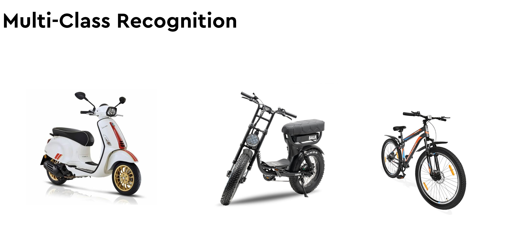
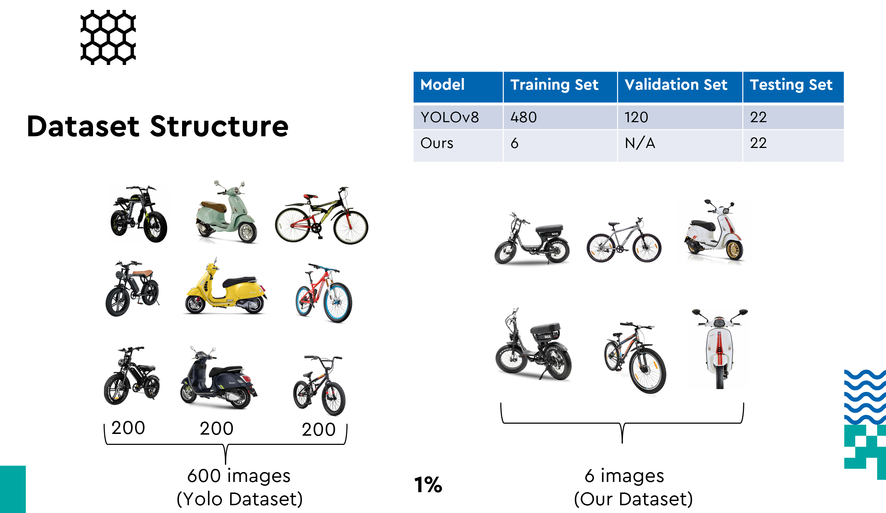
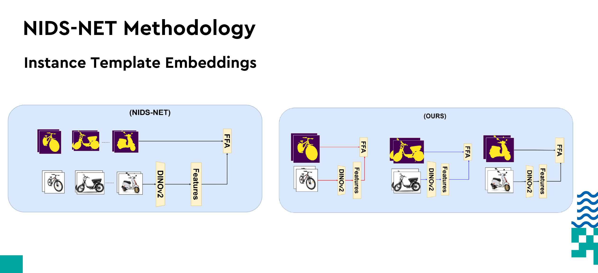
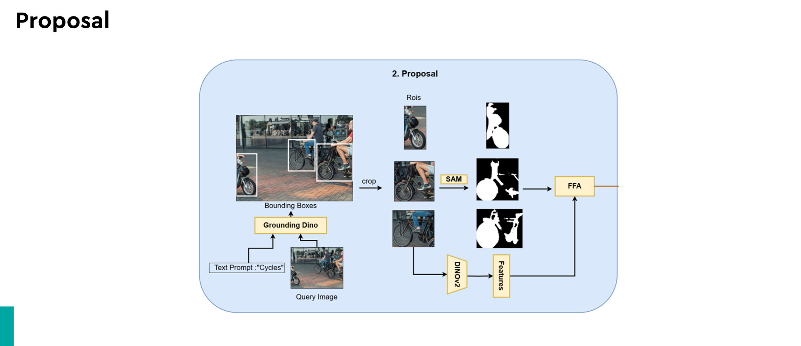
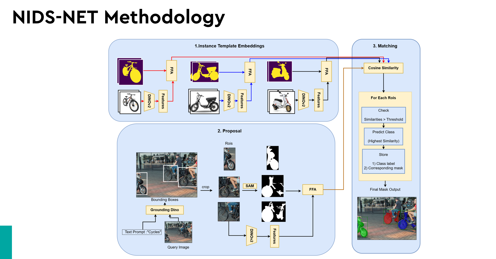
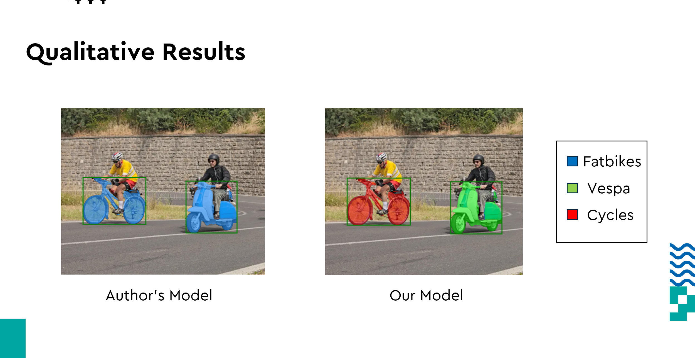
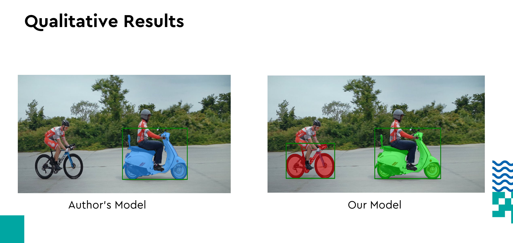
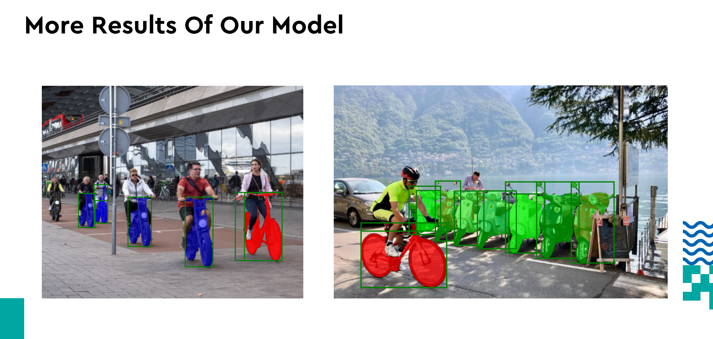
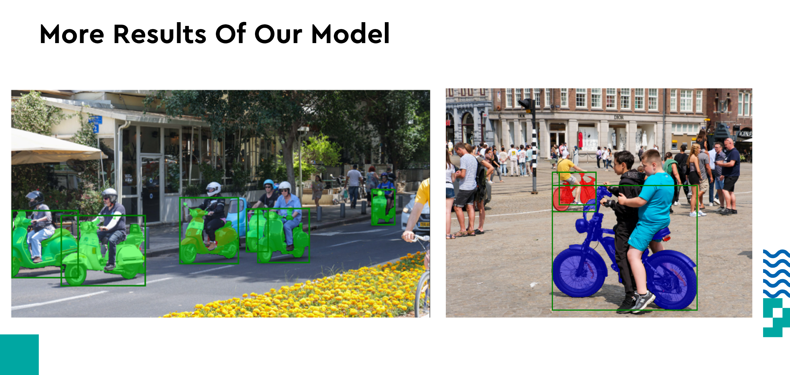
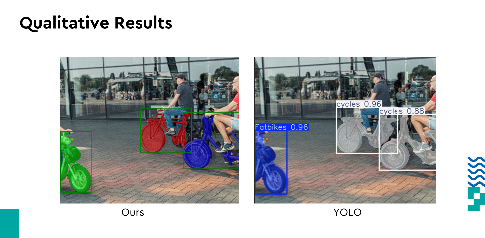

Using Multimodal Vision Language Models for object detection and instance segmentation of two wheelers in traffic scenarios.

Dataset Distribution:

Our VLM architecture only uses 2 images per class.We use foundational models such as Grounding Dino , SAM and DinoV2 to extract features from our images.

Methodology:

we develop the architecture inspired from the implementation of NIDS-NET (https://arxiv.org/abs/2405.17859).
Architectural enhancements were introduced to facilitate instance segmentation and provide the model with an understanding of distinct object classes.

Qualitative Results:

